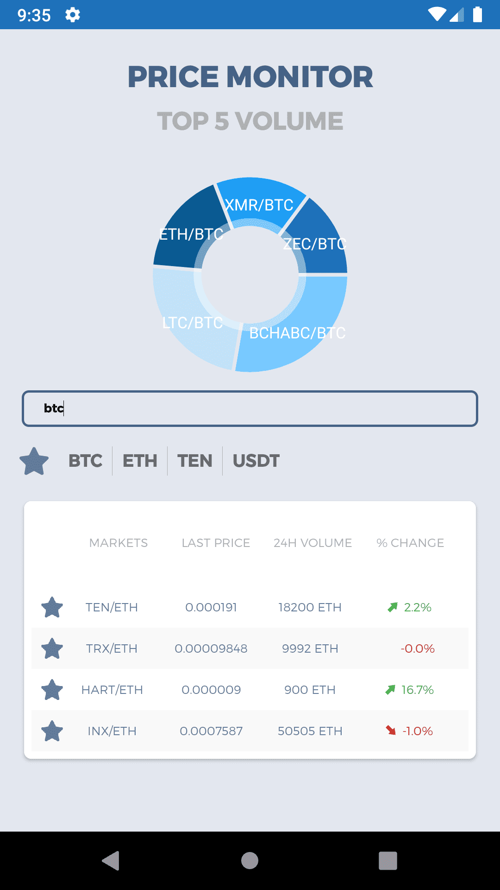

# Tokenomy Price Monitor
Consuming API from <a href ="https://exchange.tokenomy.com/api/summaries" target="_blank"> Tokenomy </a>

<h2> Images Preview </h2>

  

<h2> About this App </h2>

<ul>
  <li> Displaying market using MVVM design pattern</li>
  <li> using jetpack pro LiveData, ViewModel, Retrofit, Dagger based on Kotlin</li> 
  <li> Using cpp to secure secret key from apk that been reversed engineered</li> 
</ul>

  
  <h2> Features </h2>

<ul>
  <li> Fetch data from the api and display it to UI</li>
  <li> Implement Search based on typed query</li> 
  <li> Showing the detail of selected item</li> 
  <li> Using MPAndroidChart by PhilJay for the Pie Chart <a href ="https://github.com/PhilJay/MPAndroidChart">Link here</a></li>
</ul>

<h2> Feel free to download the apk </h2>  <a href ="https://drive.google.com/open?id=1XgJ_riT_eoDVaW08sg60WSxSsHeHA8g-">Link APK</a>

